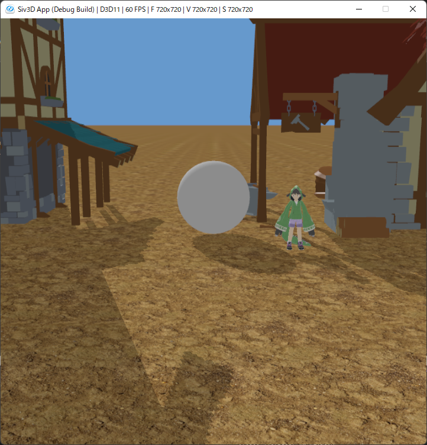
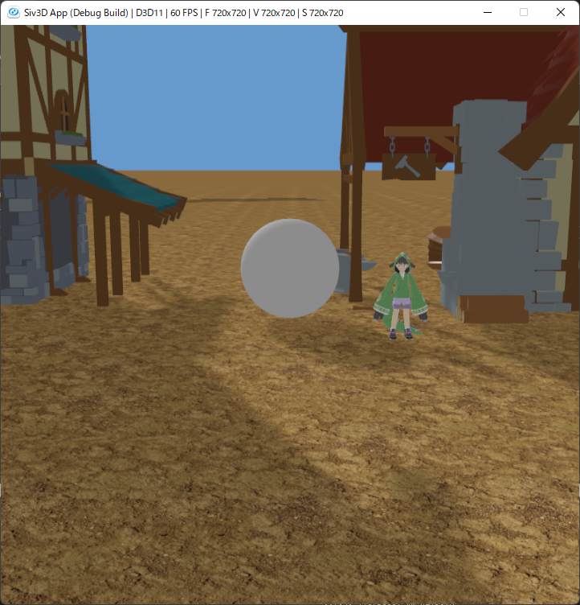

# GraphicsTechniquesInSiv3D
Implementation of various 3D graphics techniques in Siv3D.

## Implemented techniques
| Name | Code |
| ---- | ---- |
| Shadow Mapping    | Header: [ShadowMapping.h](GraphicsTechniquesInSiv3D/ShadowMapping.h)   Source: [ShadowMapping.cpp](GraphicsTechniquesInSiv3D/ShadowMapping.cpp)   Shadow map generation shader: [shadow_map_generation.hlsl](GraphicsTechniquesInSiv3D/App/shadow_map_generation.hlsl)   Main shader: [shadow_mapping.hlsl](GraphicsTechniquesInSiv3D/App/shadow_mapping.hlsl) |
| Soft shadow using Variance Shadow Map    | Header: [VarianceShadowMap.h](GraphicsTechniquesInSiv3D/VarianceShadowMap.h)   Source: [VarianceShadowMap.cpp](GraphicsTechniquesInSiv3D/VarianceShadowMap.cpp)   Shadow map generation shader: [variance_shadow_map_generation.hlsl](GraphicsTechniquesInSiv3D/App/variance_shadow_map_generation.hlsl)   Main shader: [variance_shadow_mapping.hlsl](GraphicsTechniquesInSiv3D/App/variance_shadow_mapping.hlsl) |
